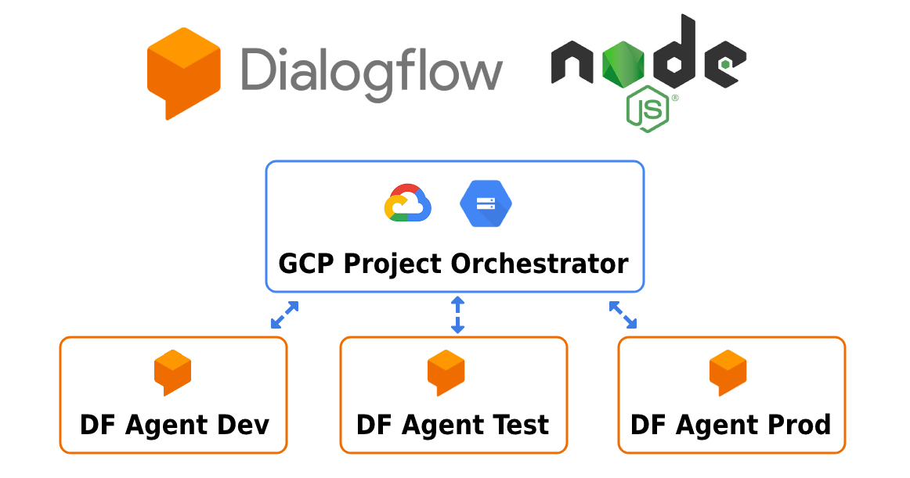

<p align="center">
  
</p>

<h1 align="center">Tutorial Dialogflow Export & Restore</h1>

<p align="center">🦾 Create a CI/CD application with which you can export and restore 💬 Dialogflow projects</p>

<p align="center">
  <a title="MIT License" href="LICENSE.md">
    
  </a>
  <a title="Twitter: JoseJ_PR" href="https://twitter.com/JoseJ_PR">
    
  </a>  
  <a title="Github: Sponsors" href="https://github.com/sponsors/JoseJPR">
    
  </a>
  <br />
  <br />
</p>

## 🔖 Description

With this repository you will learn which libraries to use and how, in order to create a CI/CD application (CLI or not) with which you can export and restore Dialogflow projects.

Imagine that you need to develop a CLI Application with Node.js that allows to export Dialogflow projects from one environment, for example: "dev" and restore them in another environment, for example: "test". You could even generate local or remote backups and versions on github with tags.

Libraries used in this project: \
[NPM Enquirer](https://www.npmjs.com/package/enquirer) \
[NPM Ora](https://www.npmjs.com/package/ora) \
[NPM Google Dialogflow](https://www.npmjs.com/package/@google-cloud/dialogflow) \
[NPM Google Storage](https://www.npmjs.com/package/@google-cloud/storage)

## 📹 Video Demo

The following video shows how you can run this application.

[](https://youtu.be/MVx1niqtUoA)

## 📌 Methodologies and Guidelines

List of methodologies and tools used in this project for compliance with Quality Assurance Code (QAC)

* ESTlint, tool for identifying and reporting on patterns found in ECMAScript/JavaScript code. \
  [NPM ESLint](https://www.npmjs.com/package/eslint) \
  [NPM ESLint | Airbnb](https://www.npmjs.com/package/eslint-config-airbnb)

## ✅ Prerequisites

In order to work with this project, your local environment must have at least the following versions:

* NodeJS Version: 14.xx
* NPM Version: 7.10.0

Create and configure GCP and Dialogflow projects:

You need to create several projects on GCP. One as "orchestrator", for example "df-demo-project-orchestator", which will allow you to export and restore Dialogflow Agents from other GCP projects, for example: "df-demo-project-dev", "df- demo-project-test", "df-demo-project-prod".

You can create AIM service accounts from here: [GCP AIM](https://console.cloud.google.com/iam-admin/iam)

You need to add the orchestrator service account in the other projects with the necessary permissions for Dialogflow.

### Orchestator Project

  1. Create a Account Service and add clave into the Account Service \
  Link: https://console.cloud.google.com/iam-admin/serviceaccounts \
  Example orchestrator email: df-demo-ci-cd@df-demo-project-orchestator.iam.gserviceaccount.com

  2. Create a Bucket into the Cloud Storage
  Link: https://console.cloud.google.com/storage/browser \
  Example name: df-demo-ci-cd

  3. Active the Dialogflow API Service
  Link: https://console.cloud.google.com/apis/library/dialogflow.googleapis.com

### Dev,Test and Prod Projects

  1. Add the Account Service of the Orchestator Project \
  Link: https://console.cloud.google.com/iam-admin/iam \
  Example orchestrator email: df-demo-ci-cd@df-demo-project-orchestator.iam.gserviceaccount.com \
  Function: Administrador de la API de Dialogflow


## 📐 How to work with this project

### 1️⃣ Add the GCP environment

You need to add the GCP credentials in the ".env" file. You can use the ".env.schema" file as a model.

```text
GOOGLE_CLOUD_CLIENT_EMAIL=
GOOGLE_CLOUD_PRIVATE_KEY=
```

### 2️⃣ Add the GCP projects configuration

You can add as many environments as you need in the Map that you can see below. This configuration must be added in the file "./src/config/gcp.js" You will see an example like this:

```js
export const ORCHESTATOR_PROJECT_ID = 'df-demo-project-orchestator';
export const ORCHESTATOR_BUCKET_URI = 'gs://df-demo-ci-cd';
export const ENVIRONMENTS_CONFIGURATION = new Map([
  ['dev', {
    agentId: 'df-demo-project-dev',
    agentLocation: 'global',
    prefixBackupName: 'dev',
  }],
  ['test', {
    agentId: 'df-demo-project-test',
    agentLocation: 'global',
    prefixBackupName: 'test',
  }],
  ['prod', {
    agentId: 'df-demo-project-prod',
    agentLocation: 'global',
    prefixBackupName: 'prod',
  }],
]);
```

### 3️⃣ Install Dependencies

```bash
$npm i
```

### 4️⃣ Run Application

```bash
$npm run start-cli
```

## License

[MIT](LICENSE.md)

## Happy Code

Created with JavaScript, lot of ❤️ and a few ☕️

## This README.md file has been written keeping in mind

[GitHub Markdown](https://guides.github.com/features/mastering-markdown/) \
[Emoji Cheat Sheet](https://www.webfx.com/tools/emoji-cheat-sheet/)
